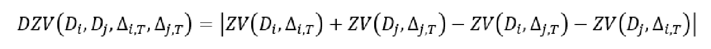
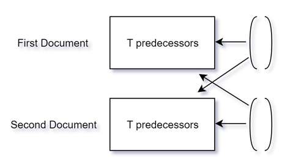
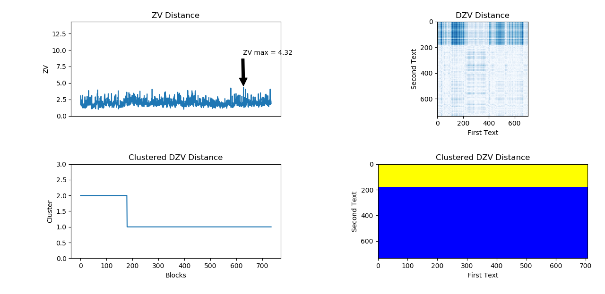

# MWSD: Multiple Writing Style Detector

 This project implements a solution of detecting numerous writing styles in a text. There are many different ways to measure how similar two documents are, or how similar a document is to a query. The project implements the first algorithm of the article with minor changes, which don't affect the outcomes. This algorithm is suggested in the ["Patterning of writing style evolution by means of dynamic similarity"](http://www.math.spbu.ru/user/gran/papers/Granichin_Pattern_Recognition.pdf) by Konstantin Amelina, Oleg Granichina, Natalia Kizhaevaa and Zeev Volkovich.

Table of Contents
-----------------

  * [Quickstart](#quickstart)
    * [Requirements](#requirements)
    * [Installation](#installation)
    * [Usage](#usage)
  * [Algorithm](#algorithm)
  * [Results](#results)
  * [Authors](#authors)
  * [License](#license)
  * [Acknowledgements](#acknowledgements)


## Quickstart

#### Requirements

All dependencies can be installed via:

```bash
pip install -r requirements.txt
```

**Note!** The project was written in Python's version 3.6.8, but there should be no problem with every 3.* or 2.* version.

#### Installation

 As known in all the python packages, in order to install the package run the next command:

```bash
python setup.py install
```

#### Usage

**Note!** There is an [example](example.py) to how to wrap the algorithm with simple main script.

The package provides 4 main features:
1. Full [algorithm](#algorithm) implementation:
    ```python
    def execute(first_text,
            second_text,
            model=None,
            T=10,
            chunk_size=50,
            n_top_keywords=1000):
    """
    Execute the Multi Writing Style Detection algorithm.

    Parameters
    ----------
    first_text : str
        The first text for the algorithm.
    second_text : str
        The first text for the algorithm.
    model : gensim.models.KeyedVectors or gensim.models.Word2Vec [optional]
        The embedding model
    T: int
        T look ahead when calculating the algorithm
    chunk_size:
        The text is divided into chunks, which is their size.
    n_top_keywords:
        The algorithm uses a certain amount of keywords, that is the quantity.

    Returns
    ----------
    (np.array, np.array, tuple): ZV distance (1 dimensional array), DZV distance (2 dimensional array), Clustering

    Clustering contains (according to indexes):
    0 - Labels array (1 dimensional array).
    1 - Distance of each element from its medoid (1 dimensional array).
    2 - Silhouette score (float).
    """
    ```
1. Text ZV distance implementation:
   ```python
   def zv(text,
        model=None,
        T=10,
        chunk_size=50,
        n_top_keywords=1000):
    """
    Calculate ZV distance of text.

    Parameters
    ----------
    text : str
        The text for the algorithm.
    model : gensim.models.KeyedVectors or gensim.models.Word2Vec [optional]
        The embedding model
    T: int
        T look ahead when calculating the algorithm
    chunk_size:
        The text is divided into chunks, which is their size.
    n_top_keywords:
        The algorithm uses a certain amount of keywords, that is the quantity.

    Returns
    ----------
    np.array: ZV distance (1 dimensional array)
    """

   ```
1. DZV distance between 2 texts:
   ```python
   def dzv(first_text,
        second_text,
        model=None,
        T=10,
        chunk_size=50,
        n_top_keywords=1000):
    """
    Calculate DZV distance of two texts.

    Parameters
    ----------
    first_text : str
        The first text for the algorithm.
    second_text : str
        The first text for the algorithm.
    model : gensim.models.KeyedVectors or gensim.models.Word2Vec [optional]
        The embedding model
    T: int
        T look ahead when calculating the algorithm
    chunk_size:
        The text is divided into chunks, which is their size.
    n_top_keywords:
        The algorithm uses a certain amount of keywords, that is the quantity.

    Returns
    ----------
    np.array: DZV distance (2 dimensional array)
    """
   ```
1. DZV distance matrix clustering:
   ```python
   def dzv_clustering(dzv,
         k=2,
         spawn=10):
    """
    Cluster DZV result using k-mediods clustering.

    Parameters
    ----------
    dzv : np.array (2 dimensional array)
        DZV distance matrix to cluster.
    k : int
        Number of desired clusters (> 2)
    spawn : int
        The number of spawns in the clustering (> 1)
    T: int
        T look ahead when calculating the algorithm

    Returns
    ----------
    (np.array, np.array, float): labels array (1 dimensional array), distance of each element from its medoid (1 dimensional array), Silhouette score
    """
    ```
1. Result visualization:
   ```python
    def visualize_algorithm_result(zv,
                               dzv,
                               clustering_result,
                               show_plot=True,
                               plot_saving_path=None):
    """
    Visualize the result of the algorithm

    Parameters
    ----------

    (np.array, np.array, tuple): ZV distance (1 dimensional array), DZV distance (2 dimensional array), Clustering

    zv : np.array (1 dimensional array)
        DZV distance array
    dzv : np.array (2 dimensional array)
        DZV distance matrix.
    clustering_result : tuple(np.array, np.array, float)
        DZV clustering result.
    show_plot : bool
        To call plt.show() or not.
    plot_saving_path: str
        Path to save the figure, None will do nothing.
    """
    ```
## Algorithm

Writing style detection algorithm performs the following steps:
1. The algorithm receives two texts for input.
1. Find the N top keywords using [tf–idf](https://en.wikipedia.org/wiki/Tf%E2%80%93idf "tf-idf in Wikipedia")
1. Remove from the texts the stopwords and words that not in the N (initially defined amount) top keywords.
1. Gather groups of 'L' (initially defined amount) keywords out of the text.
1. Use word2vec to represent each word as a vector for both documents.
1. Calculate the correlation between all the words in each group (L) using the Kolmogorov-Smirnov statistic. Each group (L) became a vector of L(L-1)/2 dimensionality.
1. Find an association between the vector and its 'T' (initially defined amount) predecessors, via: <div style="text-align:center"></div>
1. Measure the distance between the documents using: <div style="text-align:center"> </div>
1. PAM (known also as k-medoids) clustering into two clusters.

## Results

We ran the algorithm on the next two books of the famous writer [Isaac Asimov](https://en.wikipedia.org/wiki/Isaac_Asimov):
1. [Foundation and Empire (1952)](https://en.wikipedia.org/wiki/Foundation_and_Empire)
1. [Foundation and Earth (1986)](https://en.wikipedia.org/wiki/Foundation_and_Earth)

Without a doubt, the two books written by Asimov. However, because of a long time between their writing, many claim that Asimov's writing style has changed over the years.

Below is a result that shows that the books consist of two different writing styles: <div style="text-align:center"></div>

**Note!** To improve the quality of the above result we used [Google's word2vec](https://code.google.com/archive/p/word2vec/).

## Authors

* *[Roman Glozman](https://github.com/romanglo)*
* *[Yoni Shpund](https://github.com/YoniShpund)*

## License

This project is licensed under the MIT License - see the [LICENSE](LICENSE) file for details

## Acknowledgements

In some scripts, we were helped other sources. At the top of that scripts, you can find credit and link to the sources.

Additionally, big thanks for [Prof. Zeev Volkovich](mailto:zeev53@mail.ru) for his assistance in the implementation and understanding process.
